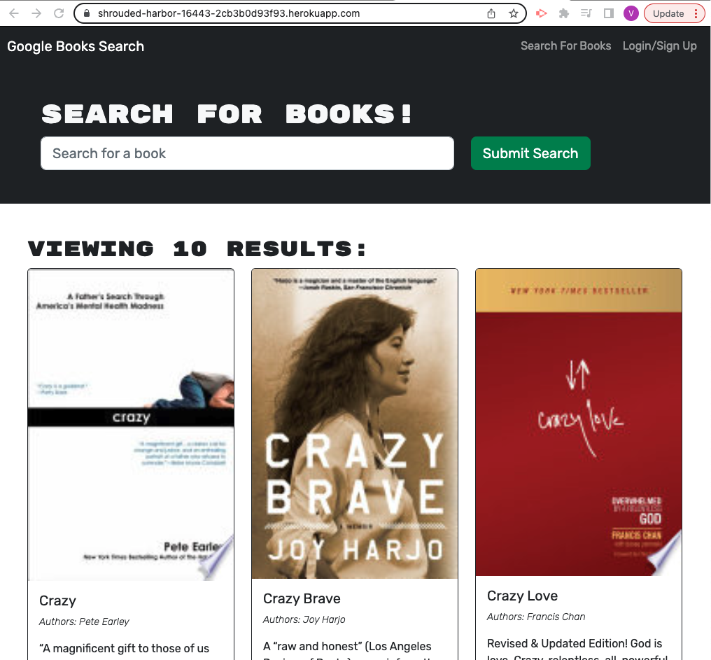

# MERN21 - Graphql

_______________________________________________________________________________________________________________________________
## Description:
This is a web application used to search and save favorite books. 
_______________________________________________________________________________________________________________________________
## Screenshot

_______________________________________________________________________________________________________________________________
## Installation:
App was created with Mongo, Express.js, React, Node and Graphql.
_______________________________________________________________________________________________________________________________
## Usage: 
Can utilize app through the browser at link listed below.
_______________________________________________________________________________________________________________________________
## License: MIT
_______________________________________________________________________________________________________________________________
## Links:
Heroku URL : https://shrouded-harbor-16443-2cb3b0d93f93.herokuapp.com/

Repository : https://github.com/VinceR66/MERN21 
_______________________________________________________________________________________________________________________________
## Questions:
Please contact me at info@me.com with additional questions.

GitHub username: VinceR66